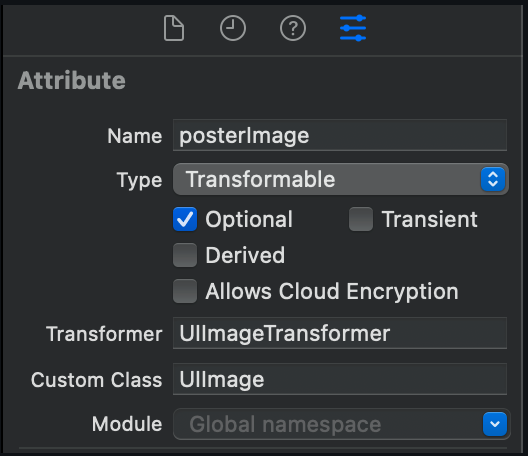
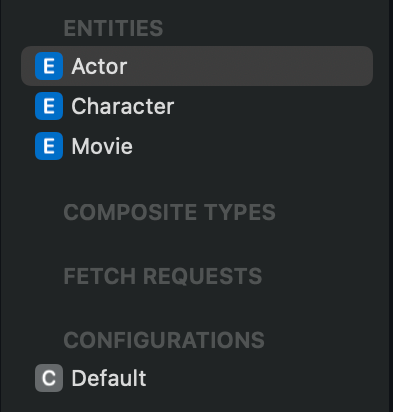
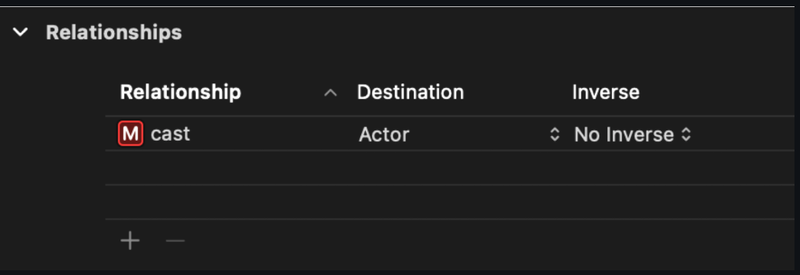
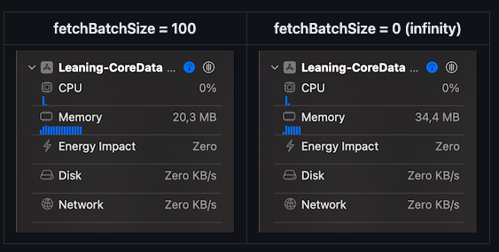

# Learning-CoreData

# I. Oveview CoreData

Khi làm việc với `CoreData`, ta có 4 thuộc tính cần quann tâm:
- `Entity`: Tương ứng với các `table` trong Database
- `Attribute`: Tương ứng với các `filed` trong tbale
- `RelationShip`: Tương ứng với các quan hệ giữa các `table` trong db
- `Managed Object` tương ứng với các `record` trong table

# II. Core Data Stack


Ta nhìn thấy rằng có 1 thằng quan trọng nhất là `NSPersistentContainer`, nhiệm vụ của `NSPersistentContainer` là wrapper 3 thằng `NSManagedObjectModel`, `NSManagedObjectContext` và `NSPersistentStoreCoordinator`. Từ `IOS10`, để setup `core data stack`, ta chỉ cần khởi tạo instance của class `NSPersistentContainer`.

```swift
class StorageProvider {

	let persistantContainer: NSPersistentContainer

	init() {
		persistantContainer = NSPersistentContainer(name: "Model")

		persistantContainer.loadPersistentStores { description, error in
			if let error = error {
				fatalError("\(error)")
			}
		}
	}
	
}
```

Để tìm hiểu sâu hơn về `Core Data Stack`, chúng ta cùng xem ví dụ về việc setup Core Data trước iOS10:

```swift
class CoreDataStack {
	lazy var managedObjectModel: NSManagedObjectModel = {
		guard let url = Bundle.main.url(forResource: "MyModel", withExtension: "momd") else {
			fatalError("Failed to locate momd file for MyModel")
		}
		guard let model = NSManagedObjectModel(contentsOf: url) else { 
			fatalError("Failed to load momd file for MyModel")
		}
		return model
	}()


	lazy var coordinator: NSPersistentStoreCoordinator = {
		let coordinator = NSPersistentStoreCoordinator(managedObjectModel: managedObjectModel)
		let documentsDirectory = FileManager.default.urls(for: .documentDirectory, in: .userDomainMask).first!
		let sqlitePath = documentsDirectory.appendingPathComponent("MyModel.sqlite")

		do {
			try coordinator.addPersistentStore(ofType: NSSQLiteStoreType,
											   configurationName: nil,
											   at: sqlitePath,
											   options: nil)
		} catch {
			fatalError("Something went wrong while setting up the coordinator \(error)")
		}

		return coordinator
	}()

	lazy var viewContext: NSManagedObjectContext = {
		let context = NSManagedObjectContext(concurrencyType: .mainQueueConcurrencyType)
		context.persistentStoreCoordinator = coordinator
		return context
	}()
}
```

## 2.1 Managed object model

`ManagedObjectModel` là trái tim và linh hồn của `Core Data store`.` Nó là nơi object graph được định nghĩa, nơi fetch request template được lưu trữ, nơi các entity, relationship và property của nó được định nghĩa.`

## 2.2 Persistent store coordinator

Theo đoạn code trên `Persistent store coordinator` được khởi tạo từ `managedObjectModel` sau đó nó thêm `persistent store (SQLite file)` vào Persistent store coordinator. `Persistent store coordinator` dùng để cung cấp 1 interface cho `persistent store` thực tế. Trong trường hợp này, `persistent store` chính là SQLite, nhưng persistent store cũng có thể là file XML, Binary, In-memory.

`Persistent store coordinator` dùng để tương tác của lớp persistent store bên dưới thông qua thông tin được cung cấp bởi `managedObjectModel`.

## 2.3 Managed object contexts

Mỗi `managed object` đều thuộc duy nhất 1 `managed object contexts`. `Context` là nơi create, load, manipulate managed object. Có thể có đồng thời nhiều context khác nhau (đọc ở chương sau để biết). Dựa theo đoạn code trên, mỗi `managed object contexts` đều liên kết với 1 `persistent store coordinator`. Mỗi khi bạn gọi `save()` hoặc `fetch(_:)` trên context, nó sẽ chuyển tiếp sang cho store coordinator, sau đó coordinator chuyển tiếp sang persistent store để tương tác với data.

- `Managed objects` nên được sử dụng trên cùng thread với context của nó. Do đó, `managed object context trên main queue` có thể truy xuất các objects để hiển thị lên UI 1 cách an toàn. Vì vậy, context trên main queue được gọi là `viewContext`. Bạn có thể tạo ra các managed object context chạy trên background thread để thực thi các tác vụ nặng.
- Hơn nữa, 1 context có thể có `child context`. Khi bạn `save()` thay đổi trên `child context`, nó sẽ không lưu vào `persistent store`. Mà thay vào đó, nó sẽ được lưu vào `parent context`. Child context có thể được sử dụng như 1 temporary context, cho phép bạn cô lập những thay đổi của managed objects (save hoặc discard change).


# III. Defining entities using the model editor

Core Data hỗ trợ các kiểu dữ liệu: undefined, Integer16, Integer32, Integer64, Decimal, Double, Float, String, Boolean, Date, Binary Data, UUID, URI, Transformable. Các kiểu dữ liệu khác đều là `primitive`. Tuy nhiên, nếu bạn muốn lưu data kiểu UIImage, CLLocationCoordinate2D thì phải làm thế nào?

- `Transformable` chính là câu trả lời. Kiểu `transformable` sẽ cho phép chúng ta lưu trữ các kiểu dữ liệu khác standard mà Core Data cung cấp. Các attribute thuộc kiểu transformable được lữu trữ trong persistent store dưới dạng `binary data`. Data này có thể convert ngược lại kiểu dữ liệu ban đầu, nó cho phép bạn lưu trữ gần như toàn bộ custom type trong model. Tuy nhiên, custom type phải representable in Objective-C. Ví dụ về lưu trữ UIImage trong `Core Data`:

1. Tạo ra 1 subclass của ValueTransformer

```swift
class UIImageTransformer: ValueTransformer {
	/// Dùng để convert `Type` sang `Data`.
	override func transformedValue(_ value: Any?) -> Any? {
		guard let image = value as? UIImage else { return nil }
		do {
			let data = try NSKeyedArchiver.archivedData(withRootObject: image, requiringSecureCoding: true)
			return data
		} catch {
			return nil
		}
	}

	/// Dùng để convert `Data` sang `Type`.
	override func reverseTransformedValue(_ value: Any?) -> Any? {
		guard let data = value as? Data else { return nil }
		do {
			let image = try NSKeyedUnarchiver.unarchivedObject(ofClass: UIImage.self, from: data)
			return image
		} catch {
			return nil
		}
	}
}
```

2. Register transformer trước khi dùng

```swift
class StorageProvider {
	// properties...

	init() {
		ValueTransformer.setValueTransformer(UIImageTransformer(), forName: NSValueTransformerName("UIImageTransformer"))
		persistentContainer = NSPersistentContainer(name: "Chapter3")
		....
	} 
}
```


3. Chỉnh sửa attribute trong model editor file




# IV. Managing relationships

Có 3 entity trong ví dụ: Movie, Actor, Character.



Có 3 kiểu relationship giữa các entity:
- one-to-one: 1 vợ - 1 chồng
- one-to-many: 1 bộ phim - nhiều review
- many-to-many: nhiều bô phim - nhiều diễn viên

Ví dụ: Movie có to-many relationship với Actor thông qua property cast



# IV. Fetching and displaying data from a Core Data store

Topic trong chương này:
- Understanding how Core Data executes a fetch request
- Understanding what faulting is, and why it’s important
- Filtering and sorting results with Predicates and sortdescriptors
- Fetching data using NSFetchedResultsController

## 4.1 Understanding how Core Data executes a fetch request

Như bạn đã biết, fetch request trong Core Data phải được thực thi bởi 1 managed object context. Ví dụ:

```swift
let request: NSFetchRequest<Movie> = Movie.fetchRequest() 
let movies: [Movie] = try viewContext.fetch(request) ?? []
```

Cùng tìm hiểu xem context thực thi fetch request như thế nào:
- Như đã nói trong chương 2, `persistent container` sẽ chứa 3 components: `managed object context, managed object model, persistent store coordinate.`
- Khi context thực thi fetch request nó sẽ convert request này thành `NSPersistentStoreRequest`. Request này được truyền cho store coordinate qua method `execute(_ request: NSPersistentStoreRequest, with context: NSManagedObjectContext).`
- Dựa trên `underlying storage`, store coordinate sẽ convert persistent store request thành SQLite query hoặc query khác sao cho phù hợp với underlying storage.

Chú ý: rằng persistent store request không chỉ dùng cho mỗi fetch request (lấy data). Nó còn dùng để lưu data trong context (save data), batch insert object, batchUpdate, batchDelete. (đọc thêm docs về NSPersistentStoreRequestType)


```swift
enum NSPersistentStoreRequestType{
    case fetchRequestType 
    case saveRequestType 
    case batchInsertRequestType 
    case batchUpdateRequestType 
    case batchDeleteRequestType 
}
```

Sau khi convert request thành query phù hợp, store coordinator sẽ lấy các records, tạo thành managed objects và kết nối chúng với managed context phù hợp. 

- Điều đặc biệt ở đây là `managed object` lấy được từ fetch request chưa hoàn chỉnh. Core Data gọi nó là `faults`.

`Fault` là một placeholder object cho data. Có nghĩa là nó cũng có objectID, underlying data có thể đã tồn tại trong memory (đọc thêm chương 5 để hiểu). Tuy nhiên, @NSManaged properies chưa được set giá trị (polulated). Core Data làm vậy để tối ưu hoá việc sử dụng memory của app khi không giữ lại những data chưa dùng đến. Cùng tìm hiểu sâu hơn về `Fault`.

## 4.2 Exploring Core Data’s faulting behavior

Fetch request mặc định sẽ fetch các object dưới dạng `faults`. Khi bạn truy cập vào các property của faults, managed context sẽ set giá trị cho chúng. Quá trình này được gọi là `firing a fault`. Khi bạn fire fault có thể có 2 trường hợp:
- `TH1`: các trường request đã tồn tại trong Core Data cache. Lúc này thì các faults sẽ được fulfill data ngay lập tức.
- `TH2`: các trường request không tồn tại trong Core Data cache. Trường hợp này xảy ra khi bạn truy cập vào 1 property là relationship. Lúc này, 1 fetch request sẽ được tự động thực thi để lấy về data cần thiết từ underlying store và faults sẽ được fulfill.

Bạn có thể fetch result dưới dạng object đầy đủ thông qua việc set property của fetch request `returnsObjectsAsFaults = false`. Trong trường hợp bạn chắc chắn sẽ truy cập vào property của 1 entity thuộc relationship. Ví dụ, bạn có entity Movie và Director, trong đó movie có trường directors biểu diễn to-many relationship. Lúc này nếu bạn muốn hiển thị 1 list movies cùng với director của nó thì việc fetch trước directors sẽ giúp UI mượt mà hơn. Để làm được điều này bạn cần configure property relationshipKeyPathsForPrefetching của fetch request. Ví dụ:

```swift
myFetchRequest.relationshipKeyPathsForPrefetching = ["directors"]
```

`Chú ý`: Việc optimization như này chỉ nên áp dụng khi bạn nhận thấy app có vấn đề về performance do faulting. Diễn giả khuyên bạn nên để default hết nhé =)).


## 4.3 Filtering and sorting results with Predicates and Sort Descriptors

### 4.3.1 Filtering with NSPredicate

Để có thể filter fetch result chúng ta sẽ sử dụng đến class `NSPredicate`:

```swift
NSPredicate(format predicateFormat: String, _ args: CVarArg...)
```

Ví dụ 1:

```swift
let oldDate = Date()

// Cách 1
let oldMoviesPredicate1 = NSPredicate(
	format: "%K < %@",
	#keyPath(Movie.releaseDate),
	oldDate as NSDate)

// Cách 2
let oldMoviesPredicate2 = NSPredicate(
	format: "%releaseDate < %@",
	oldDate as NSDate)
```

- Lọc ra những bộ phim có releaseDate nhỏ hơn 1 ngày nhất định oldDate.
- Do argument phải conform CVarArg nên phải cast date sang NSDate.
- `%K`: là keyPath placeholder.
- `%@`: là object placeholder.
- Nên sử dụng cách keyPath.

Ví dụ 2:

```swift
let moviesPredicate = NSPredicate(
	format: "(%K < %@ AND %K > %@) OR %K > %@",
	#keyPath(Movie.releaseDate), lowererBound as NSDate,
	#keyPath(Movie.releaseDate), uppperBound as NSDate,
	#keyPath(Movie.rating), minRating)
```

- Tạo compound predicate với logical operatores `(AND, OR, NOT)`.
- Thứ tự của arguments tương ứng với vị trí xuất hiện của placeholder trong format.

Ví dụ 3:

```swift
let starPredicate = NSPredicate(
	format: "%K BEGINSWITH[cd] %@",
	#keyPath(Character.movie.title), "Star")
```

- Lọc ra tất cả các vai diễn trong bộ phim được bắt đầu bằng "Star".
- "c": case insensitive, không phân biệt ký tự hoa hay thường.
- "d": diacritic insensitive, ký tự đặc biệt (có dấu) được coi là ký tự thường.

Ví dụ 4:

```swift
let notStarPredicate = NSPredicate(
	format: "NOT %K BEGINSWITH[cd] %@",
	#keyPath(Character.movie.title), "Star")
```

- Ngược lại với VD3.

Ví dụ 5:

```swift
let dateBetween: NSCompoundPredicate?
var dateClauses = [NSPredicate]()

if let lowerBound = lowerBound {
	let minDatePredicate = NSPredicate(
		format: "%K >= %@",
		#keyPath(Movie.releaseDate),
		lowerBound as NSDate)
	dateClauses.append(minDatePredicate)
}
if let upperBound = upperBound {
	let maxDatePredicate = NSPredicate(
		format: "%K <= %@",
		#keyPath(Movie.releaseDate),
		upperBound as NSDate)
	dateClauses.append(maxDatePredicate)
}

if !dateClauses.isEmpty {
	dateBetween = NSCompoundPredicate(andPredicateWithSubpredicates: dateClauses)
} else {
	dateBetween = nil
}
```

- Dùng `NSCompoundPredicate` để kết hợp các `sub-predicate`.
- `NSCompoundPredicate` kết hợp các sub-predicate bằng logical operation AND, OR, NOT. Ví dụ trên là toán tử AND.

### 4.3.2 How to limit fetch result


- Sử dụng `fetchLimit` và `fetchOffset` sẽ tạo ra pagination data.

```swift
let fetchRequest: NSFetchRequest<Movie> = Movie.fetchRequest()
fetchRequest.fetchLimit = 5
fetchRequest.fetchOffset = 10
```

- `fetchOffset`: bỏ qua n phần tử.
- `fetchLimit`: fetch tối đa n phần tử.
- Trong ví dụ trên, fetch tối đa 5 movies từ 11-15.

```swift
func fetchPage<T: NSManagedObject>(_ pageIndex: Int,
								   pageSize: Int,
								   request: NSFetchRequest<T>,
								   using context: NSManagedObjectContext) throws -> [T] {
	request.fetchLimit = pageSize
	request.fetchOffset = pageSize * pageIndex
	return try context.fetch(request)
}
```

- `fetchBatchSize`
Sử dụng `fetchBatchSize` để giảm memory. Nó thường được sử dụng cùng với `NSFetchedResultsController`.

```swift
let fetchRequest: NSFetchRequest<Movie> = Movie.fetchRequest()
fetchRequest.fetchBatchSize = 100
```

Giải thích:

- `fetchBatchSize` không giống `fetchLimit`, nó không giới hạn số lượng object có thể được fetch.
- Giả dụ core data có chứa 50000 objects và `fetchBatchSize` = 100.
- Khi này, ta vẫn sẽ fetch được tất cả 50000 objects đó. Tuy nhiên, số lượng object mà core data fetch từ `persistent store` rồi đẩy lên memory chỉ giới hạn 100 objects. Khi chúng ta scroll table view cần thêm object thì core data sẽ tự động tạo SQLite query để lấy object.
- Việc sử dụng `fetchBatchSize` sẽ chỉ load 1 số lượng nhỏ objects lên momery, điều này giúp app giảm memory không cần thiết.

Cùng nhìn qua 2 ảnh dưới đây để thấy sự khác biệt:



### 4.4.3 Sorting with NSSortDiscriptor

Nếu bạn không sort fetch requests thì thứ tự các items trả về sẽ không xác định. Để sort result chúng ta sử dụng `NSSortDescriptor`. Sort movies theo rating từ cao đến thấp.

```swift
let fetchRequest: NSFetchRequest<Movie> = Movie.fetchRequest()
fetchRequest.sortDescriptors = [
	NSSortDescriptor(keyPath: \Movie.rating, ascending: false)
]
```

Nếu như 2 movies trùng rating thì sort theo releaseDate mới hơn.

```swift
let fetchRequest: NSFetchRequest<Movie> = Movie.fetchRequest()
fetchRequest.sortDescriptors = [
	NSSortDescriptor(keyPath: \Movie.rating, ascending: false),
	NSSortDescriptor(keyPath: \Movie.releaseDate, ascending: true)
]
```

`Chú ý`: Chú ý: `sortDescriptors` sẽ áp dụng theo thứ tự của mảng. Tức là, sẽ sort movies theo rating trước sau đó mới sort theo releaseDate. Nếu không sort thì result sẽ trả về 1 cách ngẫu nhiên. Nếu bạn sử dụng fetchLimit và fetchOffset mà không sort thì có thể dính duplicate data do nó random result.


# IV. Reference

1. [Basic iOS tutorial : Core Data](https://fxstudio.dev/basic-ios-tutorial-core-data/)