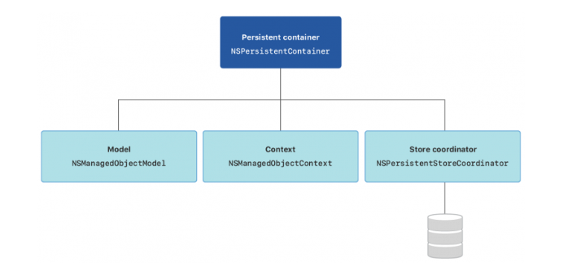
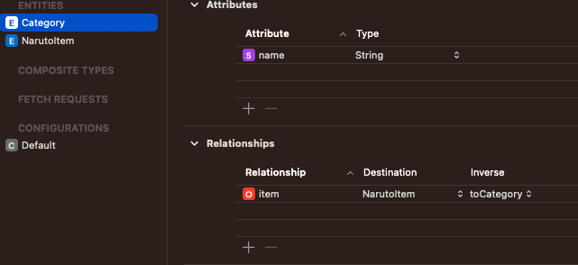
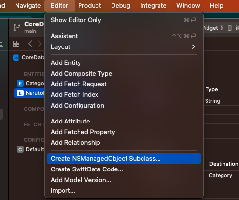

# CoreData By Viet



Về bản chất thì `CoreData` sử dụng `SQLite, XML,..` để lưu dữ liệu. Vì vậy `SQLite` cũng đơn giản là các file khác như `file trong filemanager`. Bản chất là ta tạo 1 file `SQLite`, sau đó sử dụng `CoreData` để đọc ghi dữ liệu từ file đó.

Trong `CoreData` đây ta có 4 thành phần quan trọng nhất:
- `NSManagedObjectModel`: Đây là trái tim và linh hồn `CoreData`. Nơi ta định nghĩ các `property, entity, table`.
- `NSPersistentStoreCoordinator`: Đây là lớp trung gian giữa hệ thống và `nơi thực tế lưu trữ dữ liệu`. Thằng này có nhiệm vụ đọc ghi dữ liệu trực tiếp xuống file lưu dữ liệu.
- `NSManagedObjectContext`: Có nhiệm vụ `create, load, manipulate managed object.`

# I. Các bước thực hiện

Vào `File` -> `New` -> `File` -> `Data Model`. Đặt tên `File` là `Anime`, sau đó ở `Anime` ta tiến hành add thêm `Entity` tương ứng với các `table`, đặt tên các `entity` là `Category`(Ở đây chứa danh sách các thư mục `Anime` như `naruto`, `onepiece`) va `Item`(Ở đây chứa thông tin cụ thể các `Item`). 



Chọn `Codegen` và chọn `Manual/None`, sau đó `Click Editor` và chọn `CreatemanagedObject SubClass` để render file.



## 1.1 Create Class For managed Data

```swift
class DataController: ObservableObject {
    let container = NSPersistentContainer(name: "Anime")

    init() {
        container.loadPersistentStores { description, error in
            if let error = error {
                print("Core Data failed to load: \(error.localizedDescription)")
            }
        }
    }
}
```

Để có thể load data model, ta cần gọi hàm `loadPersistentStores()`, điều này thông báo cho `Core Data` truy cập vào data model trong `Anime.xcdatamodeld`. This doesn’t load all the data into memory at the same time, because that would be wasteful, but at least Core Data can see all the information we have.

Sau đó, ta sẽ sử dụng `environment` để có thể truy cập vào core data trong toàn bộ hệ thống:

```swift
@main
struct CoreData_WidgetApp: App {
    @State private var dataController = DataController()
    
    
    var body: some Scene {
        WindowGroup {
            ContentView()
                .environment(\.managedObjectContext, dataController.container.viewContext)
        }
    }
}
```

You’ve already met data models, which store definitions of the entities and attributes we want to use, and `NSPersistentStoreContainer`, which handles loading the actual data we have saved to the user’s device. Well, you just met the third piece of the Core Data puzzle: `managed object contexts`. ` These are effectively the “live” version of your data – when you load objects and change them, those changes only exist in memory until you specifically save them back to the persistent store.`

- So, the job of the `viewContext` is to let us work with all our data in memory, which is much faster than constantly reading and writing data to disk. When we’re ready we still do need to write changes out to persistent store if we want them to be there when our app runs next, but you can also choose to discard changes if you don’t want them.
- At this point we’ve created our Core Data model, we’ve loaded it, and we’ve prepared it for use with SwiftUI. There are still two important pieces of the puzzle left: `reading data, and writing it too`. Retrieving information from Core Data is done using a `fetch request`. we describe what we want, how it should sorted, and whether any filters should be used, and Core Data sends back all the matching data.
- Chúng ta cần đảm bảo rằng `fetch request` luôn được cập nhật theo thời gian để khi data được tạo hoặc xóa, giao diện người dùng của chúng ta vẫn được đồng bộ hóa. `SwiftUI` has a solution for this, and – you guessed it – it’s another property wrapper. This time it’s called `@FetchRequest` and it takes at least one parameter describing how we want the results to be sorted. It has quite a specific format, so let’s start by adding a fetch request for `Item` – please add this property to ContentView now:

```swift
struct ContentView: View {
    @FetchRequest(sortDescriptors: []) var students: FetchedResults<Item>
    
    var body: some View {
        VStack {
            Image(systemName: "globe")
                .imageScale(.large)
                .foregroundStyle(.tint)
            Text("Hello, world!")
        }
        .padding()
    }
}
```

Ở đây, ta đã tạo 1 request với no sorting, và tiến hành show data:

```swift
struct ContentView: View {
    @FetchRequest(sortDescriptors: []) var items: FetchedResults<Item>
    
    var body: some View {
        VStack {
            ForEach(items, id: \.id) { item in
                Text(item.name!)
            }
        }
        .padding()
    }
}
```

Tuy nhiên vì ở đây, ta chưa add data, nên vì vậy giờ ta sẽ tiến hành add data vào database, ta thực hiện điều đó thông qua `viewContext` như sau:

```swift
struct CategoryView: View {
    @FetchRequest(sortDescriptors: [SortDescriptor(\.name, order: .reverse)]) var categories: FetchedResults<Category>
    @Environment(\.managedObjectContext) var context
    @State private var showingAlert = false
    @State private var showingAlertEmpty = false
    @State private var nameCategory = ""
    
    var body: some View {
        VStack(alignment: .center) {
            ZStack(alignment: .center) {
                Color.blue
                
                VStack(alignment: .leading, spacing: 8) {
                    Spacer()
                    
                    HStack(alignment: .center, spacing: 8) {
                        Text("")
                            .frame(width: 20, height: 20)
                            .padding(.leading, 15)
                        
                        Spacer()
                        
                        Text("Todoey - Category")
                            .foregroundColor(.white)
                            .bold()
                            .frame(maxWidth: .infinity)
                        
                        Spacer()
                        
                        Button(action: {
                            showingAlert.toggle()
                        }, label: {
                            Image(systemName: "plus")
                                .resizable()
                                .frame(width: 20, height: 20)
                                .foregroundColor(.white)
                                .padding(.trailing, 20)
                        })
                        
                    }
                    
                }
                .padding(.bottom, 8)
            }
            .frame(height: 90)
            .alert("Create Category", isPresented: $showingAlert) {
                TextField("", text: $nameCategory)
                Button(action: {
                    if nameCategory.isEmpty {
                        showingAlertEmpty.toggle()
                        return
                    }
                    
                    let category = Category(context: context)
                    category.name = nameCategory
                    saveContext()
                    
                }, label: {
                    Text("Add")
                })
            }
            .alert("Name cannot empty", isPresented: $showingAlertEmpty) {
                
            }
            
            VStack {
                ForEach(categories, id: \.id) { category in
                    Text(category.name!)
                }
            }
            .padding()
            
            Spacer()
        }
        
        .ignoresSafeArea()
    }
    
    
    func saveContext() {
        if context.hasChanges {
            do {
                try context.save()
                
            } catch {
                let nserror = error as NSError
                fatalError("Unresolved error \(nserror), \(nserror.userInfo)")
            }
        }
    }
}
```

Outpt:


Bạn thấy không, ta chỉ cần add thêm biến mới là cell tự update theo rồi.


# V. Reference

1. [What is the @FetchRequest property wrapper?](https://www.hackingwithswift.com/quick-start/swiftui/what-is-the-fetchrequest-property-wrapper)

